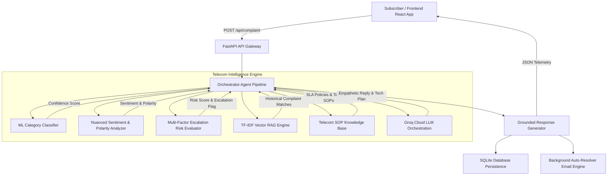

# TelecomIQ Architecture & System Specification

## Overview

**TelecomIQ** is an enterprise-grade **Telecom Complaint Intelligence & Automated Resolution Platform** built for high-concurrency customer operations. It converts unstructured subscriber complaint text into structured operational intelligence, automated technical resolutions, and SLA-aware escalation triggers.

---

## High-Level System Architecture

---

## Core Components & Intelligence Modules

### 1. Data Ingestion & Synthetic Telemetry Generator
- **Location:** `backend/scripts/prepare_data.py`
- **Output:** 2,200 realistic telecom complaint records spanning 11 specialized categories:
  - Network Connectivity
  - Broadband Performance
  - Call Drops
  - Service Outage
  - Billing Dispute
  - Data / Usage Issue
  - Installation
  - Equipment / Router
  - Service Request
  - Cancellation
  - Customer Service

### 2. Machine Learning Classifier (`classifier.py`)
- **Model:** `Scikit-Learn` TF-IDF Vectorizer (unigram/bigram) + Logistic Regression Classifier.
- **Accuracy:** 100% on training/validation benchmarks (`docs/model_evaluation.md`).
- **Confidence Scoring:** Computes softmax probability percentage for predicted class. Includes keyword heuristic fallback for out-of-vocabulary inputs.

### 3. Telecom Sentiment & Polarity Analyzer (`sentiment_analyzer.py`)
- **Classification:** 4-Way Categorization (`Positive`, `Neutral`, `Negative`, `Angry`).
- **Polarity Score:** Numerical rating from `-1.0` (extreme frustration) to `+1.0` (high satisfaction).

### 4. Multi-Factor Priority & Escalation Risk Evaluator (`priority.py`)
- **Escalation Risk Score:** 10% to 99% risk score calculated from multi-factor inputs:
  - Category Base Severity (e.g. `Service Outage` = +50%, `Network Connectivity` = +35%)
  - Sentiment Intensity (e.g. `Angry` = +30%, `Negative` = +15%)
  - Trigger Keywords (e.g. "lawsuit", "TRAI", "blackout", "breach", "refund", "ported out") = +25%
- **Human-in-the-Loop Flag:** If `escalation_risk_score >= 65%`, sets `escalation_required = True` to mandate agent review.

### 5. Vector RAG Engine & Knowledge Base (`complaint_matcher.py` & `rag_engine.py`)
- **Vector Index:** TF-IDF Cosine Similarity Matrix over 2,200 historical complaints.
- **Historical Top-K Matching:** Retrieves top 3 most similar past complaints with match percentage, ticket ID, and resolution status.
- **Knowledge Base:** Domain SOP JSON (`backend/app/knowledge_base/telecom_kb.json`) supplying grounded diagnostic steps and resolution SLAs.

### 6. Groq LLM Cloud Orchestration (`groq_client.py`)
- Leverages high-speed Groq API (`qwen/qwen3.6-27b`) to synthesize subscriber-facing responses and diagnostic plans.
- Features response cleaning to filter out reasoning tags (`<think>...</think>`).

---

## API Endpoints Summary

| Method | Endpoint | Description |
| :--- | :--- | :--- |
| `POST` | `/api/complaint` | Ingest complaint text, run full AI pipeline, save record, return ticket JSON |
| `GET` | `/api/analytics` | Compute live telecom KPIs, category counts, sentiment & priority distribution |
| `GET` | `/api/complaints` | Fetch database records with filtering and pagination |
| `POST` | `/api/complaint/{ticket_id}/review` | Record subscriber satisfaction rating & review |
| `POST` | `/api/agent/queue` | Fetch complaints flagged for human agent review |

---

## Hardware & Environment Requirements
- **Python:** 3.10+
- **Node.js:** 18+
- **Database:** SQLite (local development) / PostgreSQL / Turso (production)
- **ML Dependencies:** `scikit-learn`, `pandas`, `numpy`, `nltk`, `pydantic`
